**[Swift Shift Internal Logistics Company]**

**Research Project**

**ECL 291**

**E-commerce and Logistics Diploma**

**Supervisor: [professor’s name]**

**Student 2 Name**

**SID #**

**Student 1 Name**

**SID #**
**Presented by:**

**Student 4 Name**

**SID #**

**Student 3 Name**

**SID #**

**Student 5 Name**

**SID #**

**Academic Year 1445 AH**

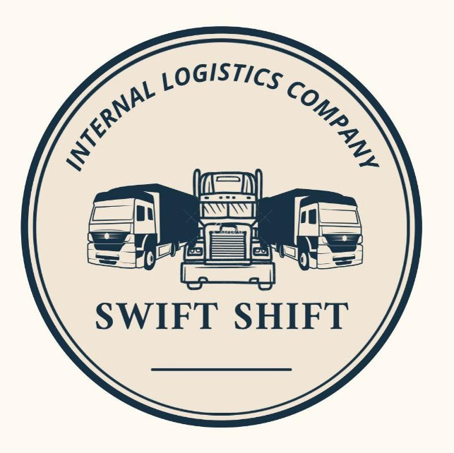

**Table of contents**

|**Items**|**Page**|
| :- | :- |
|**List of Tables**||
|**List of Figures**||
|**Executive Summary**||
|**Overview**||
|**Business Discerption**||
|**Business Project Description**||
|**Environmental Analysis** ||
|**Industry Background**||
|**Market Analysis**||
|**Management Plan**||
|**Marketing Plan**||
|**Operating Plan**||
|**Financial Plan**||
|**References**||
|**Appendices**||

**List of figures**

Figure 1: Organizational Structure of Swift Shift Internal Logistics Company

Figure 2: Market Demand Growth Trends in Saudi Arabia

Figure 3: Target Customer Segmentation

Figure 5: Business Model Canvas Overview

Figure 6: Marketing Funnel for Customer Acquisition

Figure 7: Promotional Campaign Timeline

### **List of Tables**
- Business Model Canvas
  - Table 1: Business Model Canvas Overview
- Product Description
  - Table 2: Project Products and Descriptions
  - Table 3: Characteristics and Advantages of Each Product
  - Table 4: Added Value of Each Product
  - Table 5: Customer Benefits from Each Product
- SWOT Analysis
  - Table 6: SWOT Analysis Summary
- Market Analysis
  - Table 7: Target Groups and Purchasing Power
  - Table 8: Market Demand Analysis
  - Table 9: Customer Motivations and Business Strategy
  - Table 10: Estimated Market Share and Expected Sales
- Management Plan
  - Table 11: Employee Requirements and Functional Tasks
  - Table 12: Required Competencies for Each Job
  - Table 13: Organizational Structure
- Marketing Plan
  - Table 14: Marketing Methods and Appropriateness for Target Segment
  - Table 15: Promotional Campaign Costs
  - Table 16: Effective Media for Reaching Target Market
  - Table 17: Marketing Mix Overview
  - Table 18: Sales Activity Roadmap
  - Table 19: Sample Sales Records
- Operating Plan
  - Table 20: Project Location Analysis
  - Table 21: Required Production Materials and Suppliers
  - Table 22: Tools and Machines Required
  - Table 23: Operational Records Sample
- Financial Plan
  - Table 24: Initial Capital Requirements
  - Table 25: Financial Projections for the First Three Years

### **Executive Summary**
Project Name: Swift Shift Internal Logistics Company

Project Overview:
Swift Shift Internal Logistics Company aims to provide high-quality transportation services for various goods, including furniture, electrical appliances, and vehicles, across Saudi Arabia. With a focus on delivering efficient, reliable, and affordable logistics solutions, the company will operate within the growing demand for internal logistical services, catering to both residential and commercial clients.

Business Description:
The core business of Swift Shift is to facilitate the internal movement of goods within regions of Saudi Arabia, leveraging a fleet of well-maintained vehicles and trained personnel. The company will offer services such as packing, transporting, and delivering goods, ensuring that items are handled with care and delivered on time.

Vision Statement:
To be the leading internal logistics provider in Saudi Arabia, known for our exceptional service quality, reliability, and innovative logistics solutions.

Mission Statement:
To deliver superior logistical services that exceed customer expectations while maintaining high standards of quality, safety, and sustainability. We strive to build lasting relationships with our clients through transparency and commitment to excellence.

Strategic Goals:

- Establish a robust logistics network within the first year of operation.
- Achieve a customer satisfaction rate of over 90% within two years.
- Expand service offerings to include value-added services like storage and inventory management by year three.
- Attain profitability by the end of the second year.

Market Analysis:
The logistics industry in Saudi Arabia is witnessing significant growth, driven by urbanization and increasing consumer demand for efficient delivery services. The target market includes individual consumers, small and medium enterprises, and large corporations needing reliable logistics solutions. The increasing trend of e-commerce is also expected to boost demand for logistics services.

Competitive Advantage:
Swift Shift will differentiate itself through:

- A fleet of modern, eco-friendly vehicles equipped with GPS tracking systems for real-time updates.
- Highly trained staff with expertise in handling various types of goods.
- A commitment to excellent customer service and transparent pricing.

Financial Projections:
The company anticipates achieving revenue of $500,000 in its first year, growing to $750,000 by the third year. Initial capital requirements are estimated at $514,500, covering expenses such as vehicle acquisition, marketing, and operational costs. The business expects to break even within the first 18 months of operation.

Swift Shift Internal Logistics Company is poised to capture a significant share of the logistics market in Saudi Arabia by leveraging its operational efficiency, commitment to customer satisfaction, and a strategic approach to business development. With the right execution of its business plan, the company is set to thrive in a competitive landscape, meeting the evolving needs of its customers while contributing to the growth of the logistics sector in the region.

### **Overview**
Swift Shift Internal Logistics Company is a leading provider of high-quality logistics and transportation services within Saudi Arabia. We specialize in the transportation of a wide range of goods, including furniture, electrical appliances, and vehicles. Our mission is to provide efficient, reliable, and cost-effective logistical solutions to customers who require seamless internal transportation of their belongings.

As a company dedicated to operational excellence, Swift Shift leverages a fleet of well-maintained vehicles and a team of highly trained drivers who are adept at handling long-distance transport assignments across the Kingdom. Our commitment to customer satisfaction is reflected in our focus on high-quality service delivery, competitive pricing, and attention to detail in every aspect of our operations. Whether transporting furniture for a homeowner or moving vehicles for a corporate client, Swift Shift is equipped to handle the logistical challenges of today’s fast-paced world.

With a variety of transportation solutions tailored to meet the needs of individual and business clients, we aim to be the leading internal logistics service provider in Saudi Arabia. Our team of experts works diligently to ensure that goods are transported safely, on time, and with the utmost care, making Swift Shift a trusted partner in the domestic logistics industry.
### Business Description
#### *Core Services*
1\. Furniture Transportation
Furniture transportation is one of the core services offered by Swift Shift. We understand that moving large or delicate furniture requires careful planning and handling to ensure that items arrive at their destination in perfect condition. Our team of logistics experts coordinates the safe loading, transportation, and unloading of furniture, minimizing the risk of damage throughout the process. From residential to commercial furniture, our services are designed to meet the diverse needs of our clients, providing peace of mind during the moving process.

We utilize specialized vehicles equipped with padding and other safety features to transport furniture without damage. Our experienced staff handles each item with care, ensuring it is properly secured and protected during transit. We also offer packing services to ensure that all items are safeguarded against potential damage during the move.

2\. Electrical Appliances Transport
Moving large electrical appliances like refrigerators, washing machines, and air conditioners presents unique logistical challenges. These items are often heavy, bulky, and delicate, requiring specialized equipment and expertise to move safely. Swift Shift offers tailored transport solutions for electrical appliances, ensuring they are securely loaded and safely transported to their destination.

Our drivers and loaders are trained to handle appliances with care, using state-of-the-art equipment such as dollies and ramps to minimize the risk of damage during the move. We take extra precautions to protect delicate components such as electrical wiring and sensitive internal systems, ensuring that each appliance arrives in perfect working order.

3\. Vehicle Transportation
Vehicle transportation is another key service provided by Swift Shift. Whether clients need to move cars, motorcycles, or other vehicles, we offer a reliable solution for the safe and efficient transport of vehicles across Saudi Arabia. Our fleet includes specialized vehicle transport carriers that are designed to safely accommodate different types of vehicles. We ensure that vehicles are securely loaded onto carriers and transported without any damage.

Our drivers are experienced in long-distance vehicle transport and are trained to handle the specific requirements of moving cars, ensuring they arrive at their destination on time and in the same condition as when they were picked up. Additionally, we offer insurance coverage to provide customers with peace of mind during the transportation process.
#### *Fleet and Technology*
At the heart of our logistics operations is our modern fleet of transport vehicles. We utilize a diverse range of trucks and carriers to accommodate different types and sizes of goods. Whether transporting heavy furniture, delicate electronics, or vehicles, we have the right equipment for the job.

Our fleet includes:

- Large trucks: Ideal for transporting heavy or bulky items like furniture and large appliances. These trucks are equipped with ample storage space and safety features such as padded interiors to prevent damage during transit.
- Vehicle carriers: Specifically designed for the safe transport of cars and other vehicles. These carriers are equipped with loading ramps and secure locking systems to keep vehicles in place during long-distance transport.
- Smaller transport vehicles: For transporting smaller items or handling moves in areas with limited access, such as narrow streets or urban centers.

We invest heavily in maintaining our vehicles to ensure they are in optimal condition for every transport job. Regular maintenance and safety checks are conducted on each vehicle, ensuring they meet the highest standards of performance and reliability.

In addition to our fleet, Swift Shift leverages advanced logistics technology to improve the efficiency and reliability of our services. Our GPS tracking system allows clients to monitor the location of their goods in real-time, providing peace of mind during the transport process. This system enables our logistics team to optimize routes, minimize delays, and ensure timely deliveries. Additionally, our logistics software enables us to efficiently manage bookings, schedule drivers, and coordinate deliveries, streamlining operations and improving customer satisfaction.
#### *Skilled Workforce*
Our drivers and logistics personnel are the backbone of Swift Shift Internal Logistics Company. We employ a team of highly trained and experienced professionals who are committed to providing the best possible service to our customers. Each driver undergoes rigorous training to ensure they are equipped to handle the demands of long-distance transportation. They are also well-versed in safety protocols, ensuring that all goods are handled with care and arrive at their destination without incident.

In addition to our drivers, we employ a team of logistics coordinators who manage the operational aspects of our business. These professionals work behind the scenes to ensure that each job is planned, executed, and completed to the highest standards. From scheduling drivers to managing client requests, our logistics team plays a critical role in the success of Swift Shift.
#### *Packaging and Handling*
One of the distinguishing features of our service is the emphasis we place on proper packaging and handling of goods. We understand that our clients’ belongings are valuable and often irreplaceable, which is why we take every precaution to ensure they are protected during the transportation process. Our team offers professional packing services to secure all items before they are loaded onto our transport vehicles.

For furniture and appliances, we use protective materials such as bubble wrap, blankets, and padding to safeguard against damage. Fragile items like glass tables or electronic components are carefully packed and labeled to ensure they are handled with extra care. Our packing services are designed to minimize the risk of damage and provide clients with peace of mind during their move.
#### *Competitive Advantage*
What sets Swift Shift apart from other logistics providers is our commitment to offering high-quality services at competitive prices. We understand that cost is a key consideration for our clients, which is why we offer transparent pricing and flexible service packages to suit different budgets. Our goal is to provide exceptional value for money, ensuring that clients receive premium services without paying premium prices.

In addition to competitive pricing, we offer a range of value-added services that enhance the customer experience. From real-time tracking of shipments to comprehensive insurance coverage, we go above and beyond to ensure that our clients are satisfied with every aspect of our service.
#### *Environmental Responsibility*
As a modern logistics company, Swift Shift is committed to reducing its environmental impact. We take steps to minimize our carbon footprint by optimizing routes and using fuel-efficient vehicles. Our logistics team carefully plans each transport job to ensure that goods are delivered using the most efficient routes, reducing fuel consumption and emissions. Additionally, we are exploring the use of alternative energy sources and sustainable practices in our operations to further reduce our environmental impact.
#### *Customer Satisfaction*
At Swift Shift, customer satisfaction is at the core of everything we do. We believe that a successful logistics company is built on trust, reliability, and excellent customer service. From the moment a client contacts us to the completion of their move, we work to ensure that every interaction is positive and that their expectations are met.

We offer personalized service, with each client receiving a dedicated point of contact who will oversee their job from start to finish. This ensures clear communication, prompt responses to inquiries, and a seamless experience throughout the process.

Our commitment to customer satisfaction is reflected in the positive feedback we receive from our clients. Many of our customers are repeat clients who trust us to handle their transportation needs time and time again.

Swift Shift Internal Logistics Company is a trusted provider of logistics and transportation services within Saudi Arabia. With a focus on high-quality service delivery, competitive pricing, and customer satisfaction, we offer a range of tailored solutions to meet the needs of individuals and businesses alike. Our modern fleet, skilled workforce, and commitment to environmental responsibility make us a leader in the internal logistics industry. Whether transporting furniture, appliances, or vehicles, Swift Shift is the partner of choice for efficient and reliable logistics services.
###
### Business Description
#### *Project Name*
Internal Logistical Services
#### *Project Identification*
- Company Name: Swift Shift Internal Logistics Company
- Project Type: Internal transportation services within Saudi Arabia, specializing in the transport of furniture, electrical appliances, and vehicles.
#### *Idea (Description of the Project and Business Idea)*
The idea behind Swift Shift Internal Logistics Company is to provide a comprehensive solution for the internal transportation of goods across Saudi Arabia. The company aims to facilitate the movement of household and commercial items, ensuring that furniture, appliances, and vehicles are transported safely and efficiently from one location to another.

The business model focuses on addressing the logistical challenges faced by individuals and businesses when moving goods. With a well-maintained fleet of vehicles and a team of trained professionals, Swift Shift seeks to streamline the process of moving, making it hassle-free for clients. The company emphasizes quality service delivery, timely transportation, and the careful handling of goods, which are critical factors for customer satisfaction in the logistics industry.
#### *Reason for Choosing the Idea (Explain Why This Particular Project Was Chosen)*
This project was chosen due to the growing demand for efficient logistics services in Saudi Arabia, particularly in urban areas experiencing rapid growth and development. As more people relocate for work or personal reasons, and as businesses expand, the need for reliable transportation of goods becomes increasingly important.

Additionally, the logistics sector in Saudi Arabia is seeing significant investments and innovations, making it an opportune time to enter the market. The rise of e-commerce has also amplified the demand for last-mile delivery and transportation services. Swift Shift aims to capitalize on these trends by offering specialized services that cater to both residential and commercial clients, thereby addressing a gap in the market for high-quality internal logistical solutions.
#### *The Legal Form of the Project*
The project will operate as a limited liability company (LLC). This legal structure is suitable as it provides limited liability protection to its owners while allowing for flexibility in management and operational decisions. This form also enables the company to engage in contracts, own property, and enter into legal agreements.
#### *Vision Statement*
“To be the leading provider of internal logistics solutions in Saudi Arabia, recognized for our commitment to quality, reliability, and customer satisfaction.”
#### *Mission Statement*
“Our mission is to deliver exceptional logistical services that exceed customer expectations, ensuring the safe and timely transportation of goods across Saudi Arabia. We are dedicated to fostering long-term relationships with our clients through integrity, professionalism, and a customer-centric approach.”
#### *Strategic Goals*
- Market Penetration: Establish a strong presence in key urban areas of Saudi Arabia within the first two years of operation.
- Customer Satisfaction: Achieve a customer satisfaction rate of over 90% through exceptional service delivery and responsiveness to client needs.
- Fleet Expansion: Gradually expand the fleet to accommodate increasing demand, aiming for a 20% growth in fleet size within five years.
- Sustainability Initiatives: Implement eco-friendly practices in logistics operations to reduce the company’s carbon footprint and promote sustainability within the logistics sector.
- Technological Integration: Invest in advanced logistics technology to enhance operational efficiency and customer service.
#### *Business Model Canvas*

|**Key Partners**|**Key Activities**|**Value Propositions**|**Customer Relationships**|**Customer Segments**|
| :-: | :-: | :-: | :-: | :-: |
|**- Vehicle suppliers**|- Transportation of goods|- Safe and efficient transportation|- Personalized customer service|- Individual homeowners|
|**- Packing material suppliers**|- Packing and handling services|- Competitive pricing|- Customer support hotline|- Small businesses|
|**- Maintenance service providers**|- Route planning and logistics|- High-quality service delivery|- Regular follow-ups for feedback|- Large corporations|
|**- Technology providers**|- Fleet management and maintenance|- Flexibility in service options|- Loyalty programs|- E-commerce retailers|
||- Marketing and customer outreach|- Transparency in pricing|- Active social media engagement|- Relocation companies|

|**Key Resources**|**Channels**|**Cost Structure**|**Revenue Streams**|
| :-: | :-: | :-: | :-: |
|**- Well-maintained fleet of vehicles**|- Company website|- Vehicle maintenance costs|- Service fees for transportation|
|**- Skilled workforce**|- Social media|- Fuel and operating expenses|- Packing services fees|
|**- Logistics technology systems**|- Direct sales|- Employee salaries and benefits|- Long-distance transport charges|
|**- Warehouse space**|- Partnerships with real estate firms|- Marketing and advertising expenses|- Contracted logistics services|

Figure 5: Business Model Canvas Overview
###
###
###
The business description above outlines the essential components of Swift Shift Internal Logistics Company, from its project identification and rationale to its vision, mission, strategic goals, and business model canvas. This framework not only provides a roadmap for the company’s operations but also sets the stage for achieving long-term success in the logistics industry within Saudi Arabia. By focusing on quality service delivery, customer satisfaction, and sustainable practices, Swift Shift is poised to become a leader in internal logistics services.
###
### Business Project Description
####
The purpose of Swift Shift Internal Logistics Company is to provide high-quality internal transportation services within Saudi Arabia. The project aims to address the growing demand for reliable and efficient logistics solutions, particularly for the movement of furniture, electrical appliances, and vehicles. By streamlining the logistics process and offering specialized services tailored to meet the unique needs of customers, the company seeks to enhance customer satisfaction and establish itself as a leading provider in the logistics industry. Furthermore, the project emphasizes safety, efficiency, and professionalism, ensuring that all goods are transported with care and arrive at their destinations on time.
####
The market for Swift Shift’s services primarily includes residential and commercial sectors within Saudi Arabia. Key market segments include:

- Residential Clients: Individuals and families moving to new homes, requiring the transportation of furniture and appliances.
- Small Businesses: Local shops and startups needing logistics support for their inventory and equipment.
- Large Corporations: Businesses that require the relocation of office furniture and equipment.
- E-commerce Retailers: Online businesses needing efficient logistics solutions for deliveries to customers.
- Relocation Companies: Partners looking for reliable transport services for their clients.

The increasing urbanization and growth in the housing market in Saudi Arabia present significant opportunities for internal logistics services, positioning Swift Shift to capture a substantial share of this expanding market.
#### *Who Are Your Customers?*
Swift Shift’s customers include:

- Homeowners: Individuals and families relocating or purchasing new furniture and appliances.
- Business Owners: Small and large enterprises requiring transport services for office furniture, equipment, and inventory.
- Real Estate Agencies: Agencies helping clients move into new homes or offices, requiring logistics support.
- E-commerce Companies: Online retailers needing assistance with last-mile delivery to customers.
- Relocation Services: Companies specializing in helping individuals and families move, looking for reliable transport partners.
#### *What Will Be Your Product(s)?*
The primary products offered by Swift Shift include:

|**No.**|**Product Name**|**Product Description**|
| :-: | :-: | :-: |
|**1**|Furniture Transportation|Comprehensive service for transporting household and office furniture, ensuring safe loading and unloading.|
|**2**|Appliance Transport|Specialized service for moving large electrical appliances, focusing on safe handling and secure transit.|
|**3**|Vehicle Transportation|Reliable transport for cars and motorcycles, ensuring safe loading, transport, and delivery.|
|**4**|Packing Services|Professional packing solutions for items, ensuring protection during transport with high-quality materials.|
|**5**|Logistics Consultation|Expert advice and planning services for clients needing assistance with logistics and transportation strategies.|
#### *What Distinguishes the Project Products?*

|**No.**|**Product Name**|**Characteristics and Advantages of Each Product**|
| :-: | :-: | :-: |
|**1**|Furniture Transportation|- Specialized equipment and trained staff for careful handling.  - Flexible scheduling to accommodate customer needs.|
|**2**|Appliance Transport|- Expertise in handling delicate and heavy appliances.  - Insurance coverage for added peace of mind during transport.|
|**3**|Vehicle Transportation|- Specialized carriers for safe transport of vehicles.  - Tracking systems for real-time location updates.|
|**4**|Packing Services|- Use of high-quality packing materials to prevent damage.  - Customized packing solutions tailored to each client’s needs.|
|**5**|Logistics Consultation|- Experienced consultants providing tailored logistics strategies.  - Comprehensive analysis to optimize transport efficiency.|
#### *What Is the Added Value Provided by the Project’s Services or Products?*

|**No.**|**Product Name**|**Added Value to Each Product**|
| :-: | :-: | :-: |
|**1**|Furniture Transportation|Provides a stress-free moving experience with professional handling and care for valuable belongings.|
|**2**|Appliance Transport|Ensures appliances are delivered in perfect condition, maintaining their functionality and aesthetics.|
|**3**|Vehicle Transportation|Offers peace of mind with secure transport and tracking, ensuring timely delivery of vehicles.|
|**4**|Packing Services|Minimizes the risk of damage through expert packing, ultimately saving customers from potential loss and repair costs.|
|**5**|Logistics Consultation|Delivers expert guidance to enhance logistics efficiency, helping clients save time and reduce costs in their transportation efforts.|
#### *What Will the Customer Benefit from the Project’s Services or Products?*

|**No.**|**Product Name**|**The Value Returned to the Customer and What the Product Offers to the Customer**|
| :-: | :-: | :-: |
|**1**|Furniture Transportation|Customers benefit from a reliable service that ensures their furniture arrives safely and on time, reducing stress associated with moving.|
|**2**|Appliance Transport|Provides assurance that appliances will be transported without damage, preserving their investment and functionality.|
|**3**|Vehicle Transportation|Offers a secure and efficient method for transporting vehicles, saving customers time and ensuring peace of mind during the process.|
|**4**|Packing Services|Customers gain the advantage of expert packing that protects their belongings, reducing potential losses and enhancing their overall moving experience.|
|**5**|Logistics Consultation|Clients receive tailored advice that optimizes their transportation strategy, ultimately saving them money and improving operational efficiency.|
###
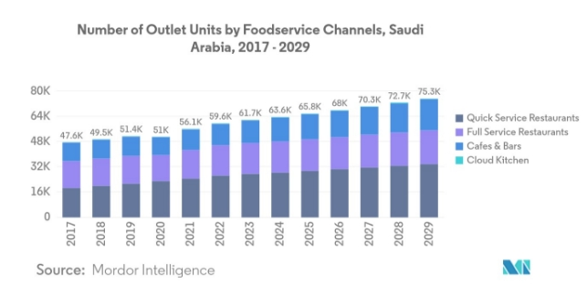 Figure 2: Market Demand Growth Trends in Saudi Arabia
###
### Conclusion
The business project description for Swift Shift Internal Logistics Company outlines the purpose, market, customer segments, and unique products offered. By focusing on quality, reliability, and customer satisfaction, Swift Shift aims to differentiate itself in the logistics industry and provide significant value to its customers. Through specialized services tailored to meet the needs of various client segments, the company is well-positioned for success in the competitive logistics landscape of Saudi Arabia.

### Business Environmental Analysis
#### *SWOT Analysis*
A SWOT analysis is a strategic planning tool used to identify the Strengths, Weaknesses, Opportunities, and Threats related to a business. Below is the SWOT analysis for Swift Shift Internal Logistics Company.

|**Strengths**|**Weaknesses**|
| :-: | :-: |
|**- Experienced Team: Skilled professionals with expertise in logistics and transportation management.**|- Limited Brand Recognition: As a new entrant in the market, the company may face challenges in gaining brand recognition.|
|**- Quality Service: Commitment to high-quality service delivery, ensuring customer satisfaction and safety of goods.**|- Resource Constraints: Initial limitations in resources, such as fleet size and technology, may affect service capabilities.|
|**- Flexibility and Adaptability: Ability to customize services based on client needs and preferences.**|- Dependence on Local Market: Relatively limited service area may restrict potential growth opportunities.|
|**- Diverse Service Offerings: Comprehensive range of logistics services, including transportation, packing, and consultation.**|- Higher Operating Costs: Initial setup costs and maintenance expenses may impact profitability in the early stages.|

|**Opportunities**|**Threats**|
| :-: | :-: |
|**- Growing Market Demand: Increasing demand for logistics services due to urbanization and e-commerce growth in Saudi Arabia.**|- Intense Competition: The logistics industry is highly competitive, with established players and new entrants.|
|**- Technological Advancements: Opportunities to leverage technology for improved efficiency, tracking, and customer service.**|- Economic Fluctuations: Economic downturns or fluctuations may affect customers' willingness to spend on logistics services.|
|**- Partnerships and Collaborations: Potential to form strategic alliances with real estate agencies, e-commerce companies, and relocation services to expand customer base.**|- Regulatory Changes: Changes in regulations or compliance requirements could increase operational complexities and costs.|
|**- Sustainability Initiatives: Growing awareness and demand for environmentally friendly logistics solutions present an opportunity to differentiate services.**|- Rising Fuel Costs: Increases in fuel prices may affect operating costs and overall profitability.|
###
The SWOT analysis for Swift Shift Internal Logistics Company highlights the internal strengths and weaknesses of the business while identifying external opportunities and threats in the market. By leveraging its strengths and capitalizing on opportunities, the company can strategically position itself for success. Addressing weaknesses and being aware of potential threats will enable Swift Shift to develop effective strategies to navigate challenges in the logistics industry.
###
### Industry Background
#### *Industry Description*
The logistics industry encompasses the processes involved in the planning, execution, and management of the flow of goods, services, and related information from the point of origin to the point of consumption. It plays a critical role in the supply chain and is vital for businesses across various sectors, including retail, manufacturing, and e-commerce. The logistics sector covers a broad range of services, including transportation, warehousing, inventory management, packing, and distribution.

In Saudi Arabia, the logistics industry has been experiencing significant growth due to several factors, including increasing urbanization, a booming e-commerce market, and substantial investments in infrastructure development. The Kingdom’s strategic location as a gateway between Europe, Asia, and Africa also enhances its importance in global trade, making it an attractive destination for logistics and transportation services.

Moreover, the Saudi government has been actively working to enhance the logistics sector as part of its Vision 2030 initiative. This initiative aims to diversify the economy, reduce dependence on oil, and develop non-oil sectors, including logistics. Investments in transportation infrastructure, such as roads, airports, and ports, along with the implementation of regulatory reforms, are expected to create a more favorable environment for logistics companies.
#### *Who Are the Competitors?*
The logistics industry in Saudi Arabia is characterized by a mix of established companies and new entrants. Key competitors include:

- Aramex: A leading logistics and transportation company with a strong presence in the Middle East and beyond, offering various services, including express delivery, freight forwarding, and e-commerce solutions.
- DHL: A global leader in the logistics industry, providing international shipping and courier services with a well-established network and advanced technology solutions.
- Saudi Post: The national postal service, which has expanded its logistics capabilities to include e-commerce and last-mile delivery services.
- Al-Faisal Express: A local logistics provider that focuses on freight forwarding and transportation services across Saudi Arabia and the Gulf region.
- Kuehne + Nagel: A global logistics company offering integrated logistics solutions, including contract logistics, sea freight, air freight, and overland transportation.
- Zajil: A logistics and distribution company based in Saudi Arabia, providing services such as freight forwarding, express delivery, and warehousing solutions.

These competitors have established themselves in the market, each with its unique strengths, weaknesses, and strategies.
#### *Who Are the Company's Key Competitors? What Are Their Strengths and Weaknesses? What Are Their Strategies?*
1\. Aramex

- Strengths:
  - Strong brand recognition and reputation in the logistics industry.
  - Extensive network and operational capabilities across the Middle East and globally.
  - Diverse service offerings, including freight forwarding and e-commerce logistics.
- Weaknesses:
  - Higher operational costs due to extensive service range and infrastructure.
  - Vulnerability to fluctuations in fuel prices, which can impact profitability.
- Strategies:
  - Continued investment in technology and innovation to enhance service delivery and customer experience.
  - Expanding e-commerce solutions to cater to the growing online shopping market.
  - Building strategic partnerships with businesses to offer integrated logistics solutions.

2\. DHL

- Strengths:
  - Global reach and extensive logistics network, enabling efficient international shipping.
  - Strong technology integration, providing real-time tracking and visibility to customers.
  - Comprehensive service offerings across multiple sectors.
- Weaknesses:
  - Higher pricing compared to local competitors, which may deter cost-sensitive customers.
  - Complexity in service offerings, which may confuse some customers.
- Strategies:
  - Focus on sustainability initiatives to reduce carbon footprint and appeal to environmentally conscious customers.
  - Investing in advanced logistics technology to improve operational efficiency and customer satisfaction.
  - Leveraging its global network to provide seamless international logistics solutions.

3\. Saudi Post

- Strengths:
  - Established brand with a strong reputation in the Kingdom.
  - Extensive network of branches and delivery services across Saudi Arabia.
  - Government backing and investment in infrastructure development.
- Weaknesses:
  - Perceived as less efficient compared to private logistics providers.
  - Limited service offerings compared to specialized logistics companies.
- Strategies:
  - Diversifying services to include e-commerce logistics and last-mile delivery.
  - Improving service efficiency and delivery speed through technology integration.
  - Collaborating with e-commerce platforms to enhance delivery capabilities.

4\. Al-Faisal Express

- Strengths:
  - Strong local presence and understanding of the Saudi market.
  - Competitive pricing and flexible service options.
- Weaknesses:
  - Limited global reach compared to larger competitors.
  - Relatively smaller fleet and resources, which may impact service scalability.
- Strategies:
  - Focusing on building customer relationships and offering personalized service.
  - Expanding service offerings to include more specialized logistics solutions.

5\. Kuehne + Nagel

- Strengths:
  - Comprehensive logistics solutions across various sectors.
  - Strong expertise in contract logistics and supply chain management.
- Weaknesses:
  - High operational costs associated with maintaining a global presence.
  - Complexity in service offerings that may lead to customer confusion.
- Strategies:
  - Leveraging technology to enhance supply chain visibility and efficiency.
  - Expanding partnerships with local companies to enhance service delivery.

6\. Zajil

- Strengths:
  - Established local logistics provider with a strong market presence.
  - Diverse service offerings, including express delivery and freight forwarding.
- Weaknesses:
  - Limited international reach compared to larger competitors.
  - Potential challenges in scaling operations to meet growing demand.
- Strategies:
  - Investing in technology to enhance service efficiency and customer experience.
  - Focusing on expanding service coverage across Saudi Arabia and the Gulf region.
#### *Industry Development and Growth: Is the Industry in Decline, Rise, or Stability?*
The logistics industry in Saudi Arabia is currently experiencing a rise. Several factors contribute to this growth:

- E-commerce Boom: The rapid growth of e-commerce, accelerated by the COVID-19 pandemic, has significantly increased demand for logistics and delivery services. With more consumers shopping online, logistics companies are adapting to provide efficient last-mile delivery solutions.
- Infrastructure Investments: The Saudi government’s investments in infrastructure, including roads, airports, and seaports, are enhancing the efficiency of logistics operations. Improved connectivity facilitates the movement of goods and reduces transportation times.
- Vision 2030: The Saudi Vision 2030 initiative emphasizes the importance of diversifying the economy and developing non-oil sectors, including logistics. This strategic focus is expected to attract further investments and drive industry growth.
- Urbanization: Increasing urbanization in Saudi Arabia is driving the need for efficient transportation solutions. As more people move to urban centers, the demand for logistics services will continue to rise.
- Global Trade: Saudi Arabia's strategic location as a hub for global trade enhances its logistics sector's importance. The country is positioning itself as a key player in regional and international logistics.
#### *What Are the Trends in the Industry?*
Several trends are shaping the logistics industry in Saudi Arabia:

1. Digital Transformation: The adoption of advanced technologies, such as artificial intelligence (AI), big data analytics, and the Internet of Things (IoT), is transforming logistics operations. These technologies enable better supply chain visibility, predictive analytics, and optimized route planning.
1. Sustainability Practices: There is a growing emphasis on sustainable logistics practices. Companies are adopting eco-friendly transportation solutions, reducing waste, and implementing green supply chain initiatives to minimize their environmental impact.
1. Last-Mile Delivery Solutions: With the rise of e-commerce, there is a significant focus on optimizing last-mile delivery. Logistics companies are investing in innovative solutions, such as using drones and electric vehicles, to enhance delivery efficiency.
1. Collaborative Logistics: Companies are increasingly collaborating to share resources and improve efficiency. Collaborative logistics involves partnerships between logistics providers, retailers, and technology companies to enhance service delivery.
1. Customized Logistics Solutions: There is a growing demand for tailored logistics solutions that meet specific customer needs. Companies are offering specialized services, such as temperature-controlled transportation for perishable goods and customized packing solutions.
1. Investment in Workforce Development: As the logistics industry evolves, there is a focus on developing a skilled workforce. Companies are investing in training and development programs to ensure that employees have the necessary skills to adapt to new technologies and processes.
### Conclusion
The logistics industry in Saudi Arabia is on an upward trajectory, driven by various factors such as the e-commerce boom, government investments, and a focus on sustainability. While the competitive landscape includes several key players with distinct strengths and weaknesses, Swift Shift Internal Logistics Company is well-positioned to carve out a niche by offering specialized services tailored to meet the needs of customers. By leveraging industry trends and embracing innovation, the company can capitalize on the growth opportunities in this dynamic sector.
###
### Market Analysis
#### *Who is the Target Group(s)?*
Swift Shift Internal Logistics Company targets a diverse range of customer segments, including:

1. Households: Individuals and families looking for moving services, including transportation of furniture, appliances, and personal belongings.
1. E-commerce Businesses: Online retailers that require logistics solutions for the timely and efficient delivery of goods to customers.
1. Retailers and Wholesalers: Businesses needing logistics support for inventory management, transportation, and warehousing.
1. Corporate Clients: Companies that require logistics services for employee relocations, office moves, or transportation of equipment.
1. Manufacturers: Industries needing reliable transportation for raw materials and finished goods.
1. Event Planners: Organizations that require logistics support for transporting equipment and materials for events and exhibitions.

By catering to these segments, Swift Shift can capture a wide range of customers and meet various logistical needs.
#### *What About the Purchasing Power of Individuals?*
The purchasing power of individuals in Saudi Arabia is influenced by several factors, including economic stability, income levels, and urbanization. The Kingdom has seen a steady increase in the average income of its citizens, leading to a growing middle class with disposable income to spend on logistics services.

Additionally, as e-commerce continues to flourish, many consumers are willing to invest in reliable logistics services for faster and more efficient deliveries. The increasing demand for quality service and customer satisfaction has also elevated individuals' willingness to pay for premium logistics solutions.
#### *How Big Was the Demand in the Past Years?*
Over the past few years, demand for logistics services in Saudi Arabia has been on the rise due to various factors:

1. E-commerce Growth: The shift towards online shopping, especially during the COVID-19 pandemic, has led to a surge in demand for last-mile delivery services. According to reports, the e-commerce market in Saudi Arabia is expected to grow significantly, with projections indicating growth rates exceeding 20% annually.
1. Infrastructure Development: Investments in infrastructure, including roads, ports, and airports, have enhanced the logistics capabilities within the country, leading to increased demand for transportation and warehousing services.
1. Economic Diversification: The Saudi government’s Vision 2030 initiative aims to diversify the economy, which includes enhancing the logistics sector. This focus has driven demand for more efficient logistics services.
1. Urbanization: Rapid urbanization has led to increased movement of goods and services, further contributing to the rising demand for logistics solutions.
#### *Is Supply Greater Than Demand or Vice Versa?*
Currently, the logistics industry in Saudi Arabia is experiencing a phase where demand is greater than supply. This imbalance is primarily due to:

1. E-commerce Surge: The rapid growth in e-commerce has outpaced the ability of some logistics providers to meet the demand for quick and efficient delivery services.
1. Infrastructure Constraints: While significant investments have been made, certain areas still face limitations in logistics infrastructure, leading to capacity constraints in supply.
1. Labor Shortages: There is a growing demand for trained logistics professionals and drivers, which is currently not being met, resulting in bottlenecks in service delivery.

As a result, logistics providers who can effectively manage this demand will likely gain a competitive advantage in the market.
#### *What Motivates a Customer to Buy Products or Request Project Services?*
Several factors motivate customers to choose logistics services:

1. Reliability: Customers prioritize reliability and timely delivery. They want assurance that their goods will arrive in perfect condition and on time.
1. Quality of Service: High-quality service, including customer support, tracking capabilities, and professional handling of goods, motivates customers to select a particular logistics provider.
1. Pricing: Competitive pricing is a significant factor. Customers often weigh the cost of services against the perceived value and quality offered.
1. Recommendations and Reviews: Positive reviews and recommendations from friends or online platforms can significantly influence customer decisions.
1. Convenience: The ease of booking and managing logistics services, along with options for customization, can attract customers looking for hassle-free solutions.
1. Brand Reputation: Established companies with a strong brand reputation often have a competitive advantage, as customers tend to trust known entities.
#### *Why Will Customers Choose the Business's Products or Services Instead of Going to Competitors?*
Customers are likely to choose Swift Shift Internal Logistics Company for several reasons:

1. Customized Solutions: Swift Shift offers tailored logistics solutions that cater specifically to the unique needs of each customer, ensuring a personal touch.
1. Quality Assurance: A commitment to high-quality service and the safety of goods will instill confidence in customers.
1. Competitive Pricing: Offering competitive rates without compromising service quality can attract price-sensitive customers.
1. Local Expertise: Being a local company, Swift Shift understands the regional market dynamics and customer preferences better than international competitors.
1. Technology Integration: Utilizing technology for tracking, management, and customer interaction can enhance the overall customer experience.
1. Strong Customer Relationships: Focusing on building long-term relationships with customers through excellent service and support can lead to repeat business and referrals.
#### *What is the Business Strategy?*
Swift Shift's business strategy revolves around several key components:

1. Customer-Centric Approach: Prioritizing customer satisfaction by offering personalized services and reliable solutions.
1. Technology Utilization: Investing in technology to improve operational efficiency, tracking capabilities, and customer interaction.
1. Market Penetration: Aggressively marketing services to reach diverse customer segments and establish a strong brand presence in the local market.
1. Quality Control: Implementing strict quality control measures to ensure the safety and reliability of services.
1. Partnerships: Building strategic partnerships with local businesses, e-commerce platforms, and real estate agencies to enhance service offerings and reach.
1. Sustainability: Incorporating sustainable practices in operations to appeal to environmentally conscious consumers and align with global trends.
#### *Estimating Your Market Share (Expected Sales) or Demand for Product*
Estimating market share and expected sales involves analyzing market data, industry trends, and competitive positioning.

1. Market Size: The logistics market in Saudi Arabia is projected to reach approximately $28 billion by 2025, growing at a CAGR of about 10% from 2020 to 2025.
1. Target Market Share: Swift Shift aims to capture around 5-10% of the local market within the first three years of operation. This estimate is based on the company's unique value proposition, quality service, and strategic marketing efforts.
1. Expected Sales: If the target market size is estimated at $28 billion, capturing a 5% market share would result in expected sales of approximately $1.4 billion. This figure will depend on the successful implementation of marketing strategies, customer acquisition, and retention efforts.
1. Growth Projections: As the company establishes its presence and builds a customer base, sales are expected to grow by approximately 20-25% annually, reflecting the overall industry growth and increasing demand for logistics services.
###
The market analysis for Swift Shift Internal Logistics Company reveals a favorable environment for growth, driven by rising demand, evolving consumer preferences, and ongoing investments in infrastructure. By targeting diverse customer segments, providing high-quality services, and leveraging technology, Swift Shift is well-positioned to capture market share and achieve sustainable growth in the logistics industry. Understanding the motivations of customers and differentiating from competitors will be crucial in establishing a strong foothold in this competitive landscape.
###
### Management Plan
#### *Number of Employees Required for the Project*
To effectively run Swift Shift Internal Logistics Company, the following positions are essential for the successful operation of the business:

|**No.**|**Job Title**|**Functional Tasks**|**Number of Employees**|
| :-: | :-: | :-: | :-: |
|**1**|Operations Manager|Oversee daily operations, manage logistics processes, ensure quality control, and coordinate with other departments.|1|
|**2**|Drivers|Safely transport goods, handle loading and unloading, ensure vehicle maintenance, and provide excellent customer service during deliveries.|10|
|**3**|Customer Service Representative|Handle customer inquiries, manage bookings, resolve issues, and maintain customer relationships.|3|
|**4**|Warehouse Staff|Manage inventory, assist with packing and unpacking, and ensure safety standards are met in the warehouse.|5|
|**5**|Marketing Specialist|Develop marketing strategies, manage social media, conduct market research, and promote the company’s services.|1|
#### *The Type of Competencies Required for Each Job*

|**No.**|**Job Title**|**Required Competencies**|
| :-: | :-: | :-: |
|**1**|Operations Manager|Leadership, organizational skills, knowledge of logistics management, problem-solving, and communication skills.|
|**2**|Drivers|Valid driving license, knowledge of road safety regulations, good driving skills, customer service orientation, and physical fitness.|
|**3**|Customer Service Representative|Strong communication skills, patience, problem-solving abilities, knowledge of the company’s services, and experience in customer service.|
|**4**|Warehouse Staff|Attention to detail, ability to operate warehouse equipment, physical stamina, organizational skills, and familiarity with safety regulations.|
|**5**|Marketing Specialist|Creativity, strong communication skills, analytical skills, knowledge of digital marketing tools, and experience in market research.|
#### *What is the Company's Organizational Structure?*
### Organizational Structure of Swift Shift Internal Logistics Company
The organizational structure of Swift Shift Internal Logistics Company is designed to ensure efficient operations, clear communication, and effective management of resources. Below is a description of the key positions and departments within the organization:
#### *1. **Executive Management***
- Chief Executive Officer (CEO): The CEO is responsible for the overall vision, strategy, and direction of the company. They oversee all operations and ensure that the company's goals and objectives are met.
- Chief Operating Officer (COO): The COO manages day-to-day operations and implements the CEO's vision. They ensure that logistical processes run smoothly and efficiently.
#### *2. **Operations Department***
- Operations Manager: Responsible for overseeing logistics operations, including transportation and delivery. They ensure that services meet quality standards and are delivered on time.
- Fleet Manager: Manages the company's fleet of vehicles, including maintenance schedules, vehicle procurement, and ensuring compliance with safety regulations.
- Logistics Coordinators: Handle day-to-day logistical tasks such as scheduling deliveries, managing inventory, and coordinating with drivers and customers.
#### *3. **Sales and Marketing Department***
- Sales and Marketing Manager: Develops and implements marketing strategies to attract new customers and retain existing ones. They also manage the sales team and oversee customer relationship management.
- Sales Representatives: Engage with potential clients, promote services, and close sales. They maintain relationships with existing customers to ensure satisfaction and repeat business.
- Marketing Specialists: Focus on creating promotional materials, managing digital marketing campaigns, and conducting market research to identify opportunities for growth.
#### *4. **Customer Service Department***
- Customer Service Manager: Oversees the customer service team, ensuring high levels of customer satisfaction and efficient handling of inquiries and complaints.
- Customer Service Representatives: Serve as the primary point of contact for customers, addressing their questions, resolving issues, and providing information about services.
#### *5. **Human Resources Department***
- HR Manager: Responsible for recruiting, training, and managing employee relations. They ensure that the company adheres to labor laws and promotes a positive workplace culture.
- Training and Development Specialist: Focuses on employee training programs, ensuring staff is equipped with the necessary skills to perform their roles effectively.
#### *6. **Finance and Accounting Department***
- Finance Manager: Oversees the company’s financial health, including budgeting, forecasting, and financial reporting.
- Accountants: Handle daily accounting tasks, including invoicing, payroll, and financial record-keeping.
#### *7. **Information Technology Department***
- IT Manager: Manages the company’s technology infrastructure, ensuring all systems are functional and secure.
- IT Support Specialists: Provide technical support to staff, troubleshooting hardware and software issues.
### Organizational Chart

### Summary
The organizational structure of Swift Shift Internal Logistics Company is designed to facilitate effective communication and efficient workflow across all departments. Each role is clearly defined, ensuring accountability and streamlined operations, ultimately leading to high levels of customer satisfaction and business success. This structure supports the company's mission to provide superior logistical services while fostering a collaborative and productive work environment.

### Marketing Plan
#### *What Marketing Methods Will Be Relied Upon?*
Swift Shift Internal Logistics Company will utilize a combination of traditional and digital marketing methods to reach its target customers effectively. The primary methods include:

1. Digital Marketing Tools:
   1. Social Media Marketing: Engaging customers through platforms like Facebook, Instagram, and LinkedIn to promote services, share customer testimonials, and run targeted ads.
   1. Search Engine Optimization (SEO): Optimizing the company website to rank higher on search engines, making it easier for potential customers to find logistics services.
   1. Email Marketing: Sending regular newsletters, promotions, and service updates to a targeted audience to maintain engagement and drive sales.
   1. Content Marketing: Creating informative blog posts and articles related to logistics, moving tips, and industry trends to establish authority and attract organic traffic.
1. Traditional Marketing Methods:
   1. Flyers and Brochures: Distributing printed materials in strategic locations, such as real estate offices, community centers, and shopping malls.
   1. Networking and Trade Shows: Participating in industry-related events to connect with potential clients and showcase services.
   1. Local Advertising: Utilizing local newspapers, radio stations, and community boards to reach local residents and businesses.
#### *Are the Marketing Methods Used Appropriate for the Targeted Customer Segment?*
Yes, the marketing methods chosen are tailored to reach the target customer segments effectively:

1. E-commerce Businesses and Retailers: Digital marketing methods, particularly social media and email campaigns, are highly effective in reaching these tech-savvy customers.
1. Households: Traditional marketing methods, such as flyers and local advertising, will appeal to families and individuals looking for moving services.
1. Corporate Clients: Networking events and trade shows will help establish relationships with businesses requiring logistics services.

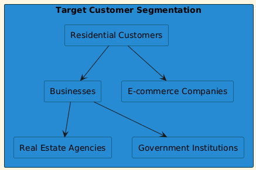Figure 3: Target Customer Segmentation

#### *How Much Will the Promotional Campaign Cost?*
The estimated costs for the promotional campaign for the first year are as follows:

|**Activity**|**Estimated Cost ($)**|
| :-: | :-: |
|**Social Media Advertising**|5,000|
|**Search Engine Optimization (SEO)**|3,000|
|**Email Marketing**|1,500|
|**Content Marketing**|2,000|
|**Flyers and Brochures**|1,000|
|**Local Advertising**|2,000|
|**Networking Events and Trade Shows**|4,000|
|**Total Estimated Cost**|$18,500|
#### *Which Media Are Most Effective in Reaching the Target Market?*
The most effective media for reaching the target market include:

1. Social Media Platforms: Facebook and Instagram for visual marketing and engagement, and LinkedIn for B2B connections.
1. Email: Targeted email campaigns to maintain customer relationships and inform them of promotions.
1. Search Engines: Google Ads for immediate visibility and targeted reach.
1. 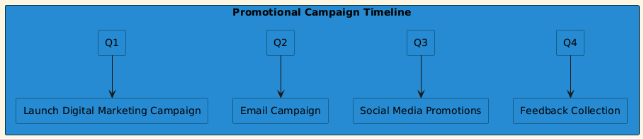Local Publications: Community newspapers and magazines for reaching local households and businesses.
#### *Figure 7: Promotional Campaign Timeline*

#### *Defining Marketing Mix*
The marketing mix for Swift Shift Internal Logistics Company will focus on the 4 Ps:

1. Product: High-quality logistics services, including transportation of furniture, appliances, and vehicles, tailored to meet customer needs.
1. Price: Competitive pricing strategy, providing value for money while maintaining quality service.
1. Place: Services offered throughout Saudi Arabia, with a focus on urban areas and regions with high demand for logistics.
1. Promotion: A combination of digital and traditional marketing strategies to maximize reach and engagement.
#### *Are the Marketing Methods Used Appropriate for the Targeted Customer Acquisition?*
Yes, the marketing methods are tailored to effectively reach the target customer Acquisition.

####
####
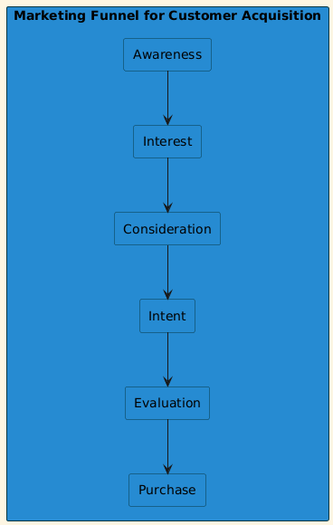

Figure 6: Marketing Funnel for Customer Acquisition

#### *Sample Roadmap for Sales Activities*

|**Measures/Activities**|**Date**|**Responsible**|
| :-: | :-: | :-: |
|**Sales campaign for product 1 - direct marketing**|Month 1-2|Marketing Specialist|
|**Sales campaign for product 1 - Email**|Month 3|Customer Service Rep|
|**E-Mail campaign for the accessory of product 1**|Month 3|Marketing Specialist|
|**Telephone campaign for the accessory of product 1**|Month 4|Customer Service Rep|
|**Event for product 2**|Month 5|Marketing Specialist|
|**E-Mail campaign for product 3**|Month 6|Marketing Specialist|
|**E-Mail campaign for the accessory of product 1**|Month 7|Marketing Specialist|
|**E-Mail campaign for product 2**|Month 8|Marketing Specialist|
#### *Sample Sheet for Sales Records*

|**Year**|**Product / Product Group 1**||||||
| :-: | :-: | :-: | :-: | :-: | :-: | :-: |
||Sales Volume|Unit Price ($)|Gross Sales (%)|Revenue Reduction ($)|Other Distribution Costs ($)|Net Sales ($)|
|**Y1**|1,000|200|80|10,000|5,000|150,000|
|**Y2**|1,200|220|85|12,000|5,500|196,500|
|**Y3**|1,500|250|90|15,000|6,000|255,000|
|**Y4**|1,800|270|92|18,000|6,500|307,500|
|**Y5**|2,000|300|95|20,000|7,000|360,000|

|**Year**|**Product / Product Group 2**||||||
| :-: | :-: | :-: | :-: | :-: | :-: | :-: |
||Sales Volume|Unit Price ($)|Gross Sales (%)|Revenue Reduction ($)|Other Distribution Costs ($)|Net Sales ($)|
|**Y1**|800|150|75|6,000|3,000|111,000|
|**Y2**|1,000|160|78|7,000|3,200|132,800|
|**Y3**|1,200|170|80|8,000|3,500|153,500|
|**Y4**|1,500|180|82|9,000|3,800|173,700|
|**Y5**|1,800|200|85|10,000|4,000|216,000|

|**Total**|||||||
| :-: | :-: | :-: | :-: | :-: | :-: | :-: |
||Sales Volume|Unit Price ($)|Gross Sales (%)|Revenue Reduction ($)|Other Distribution Costs ($)|Net Sales ($)|
||3,800||||||
||||||||
###
The marketing plan for Swift Shift Internal Logistics Company is designed with a blend of digital and traditional strategies tailored to reach its target customers effectively. The filled tables provide a clear picture of the estimated costs, sales projections, and roadmaps for marketing activities, enabling the company to strategize effectively for growth in the logistics market.
###
### 8\. Operating Plan
#### *Project Location*
1. Location: Riyadh, Saudi Arabia
1. Facility Type: Warehousing and logistics center with a vehicle fleet yard.
#### *Is the Project Location Suitable?*
Yes, the location in Riyadh is strategic due to:

1. Proximity to major highways for efficient transportation.
1. Access to a large customer base.
1. Availability of skilled labor in the area.
1. Proximity to suppliers and other logistics companies.
#### *Materials Required to Produce Products or Provide Services*

|**No.**|**Production Materials**|**How to Get It**|**Suppliers**|**Cost ($)**|
| :-: | :-: | :-: | :-: | :-: |
|**1**|Moving trucks|Purchase from dealership|Local automotive dealers|300,000|
|**2**|Packing materials|Buy in bulk|Packaging suppliers|5,000|
|**3**|GPS and tracking systems|Purchase from tech providers|Technology suppliers|10,000|
|**4**|Office supplies|Purchase from retailers|Local office supply stores|2,000|
|**5**|Furniture for office|Purchase from furniture stores|Local furniture stores|5,000|
#### *Tools and Machines Required to Complete the Work*
1. Forklifts for loading and unloading.
1. Pallet jacks for moving goods.
1. Computer systems for tracking inventory and managing logistics.
1. Communication equipment for coordination (e.g., radios and mobile phones).
#### *Impact of Expected Government Decisions on the Project*
1. Government regulations on transportation and logistics can affect operational costs (e.g., fuel taxes).
1. Incentives for logistics companies may provide tax breaks or subsidies.
1. Compliance with safety and environmental regulations will require additional training and possible investment in cleaner technologies.
#### *Sample Sheet for the Records of Operations Plan*

|**Information**|**Y1**|**Y2**|**Y3**|**Y4**|**Y5**|
| :-: | :-: | :-: | :-: | :-: | :-: |
|**Production volume (quantity)**|1,500|2,000|2,500|3,000|3,500|
|**Utilization of the capacity (%)**|75%|85%|90%|95%|100%|
|**Employees (number)**|20|25|30|35|40|
|**Costs of material ($)**|50,000|65,000|80,000|95,000|110,000|
|**External services ($)**|10,000|12,000|15,000|18,000|20,000|
|**Personnel costs ($)**|150,000|180,000|210,000|250,000|300,000|
|**Depreciation ($)**|20,000|25,000|30,000|35,000|40,000|
|**Other production costs ($)**|5,000|6,000|7,000|8,000|9,000|
|**Total quality costs ($)**|15,000|18,000|22,000|26,000|30,000|
|**Total production costs ($)**|250,000|306,000|364,000|426,000|479,000|
|**Production costs / revenue (%)**|60%|58%|55%|52%|50%|

### 9\. Financial Plan
#### *Specifying Your Business Capital Requirements*
How much financing (capital) will the project need and when?

|**No.**|**Item**|**Amount ($)**|**Timing**|
| :-: | :-: | :-: | :-: |
|**1**|Salaries and wages|120,000|Monthly|
|**2**|Payroll expense|30,000|Monthly|
|**3**|Rent expense|24,000|Annual|
|**4**|Marketing expense|18,500|Initial|
|**5**|Permits|5,000|Initial|
|**6**|Office supplies|2,000|Initial|
|**7**|Equipment|300,000|Initial|
|**8**|Furniture and Fixture|5,000|Initial|
|**9**|Other|10,000|Initial|
|**Total Initial Capital Requirements**|$514,500|||
#### *Financial Projections*
Income projections for the first three years

||**First Year ($)**|**Second Year ($)**|**Third Year ($)**|
| :- | :-: | :-: | :-: |
|**Sales**|500,000|600,000|750,000|
|**Sales Cost**|250,000|306,000|364,000|
|**Net Sales**|250,000|294,000|386,000|
|**Administrative Expenses**|50,000|60,000|70,000|
|**Marketing Expenses**|18,500|20,000|22,000|
|**Operating Profit**|181,500|214,000|294,000|
|**Zakat and Taxes**|20,000|25,000|30,000|
|**Net Profit**|161,500|189,000|264,000|
#### *When Does the Project Start Making Profits and Reach the Break-Even Point?*
1. The project is expected to reach its break-even point within the first 18 months of operation, depending on demand and market conditions.
1. Profits will begin in the first year, with significant growth anticipated in the second and third years as brand recognition and customer base expand.

This operational and financial plan outlines the critical components necessary for the success of the Swift Shift Internal Logistics Company, providing a solid foundation for launching and managing the business effectively.

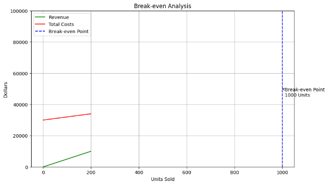

Figure 11: Break-even Analysis Graph
###
### Screenshots:
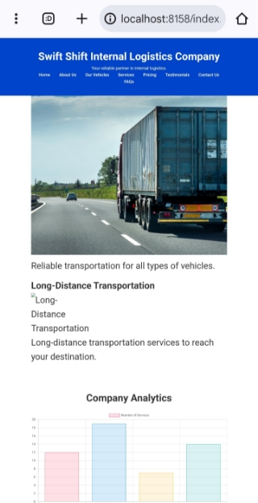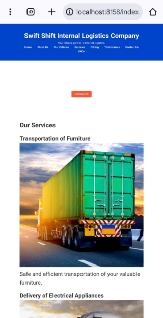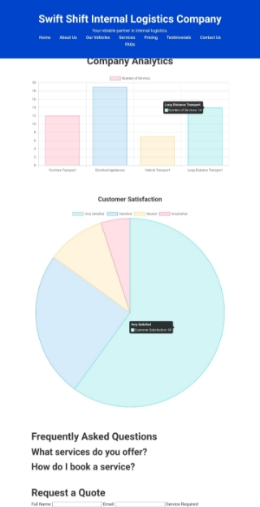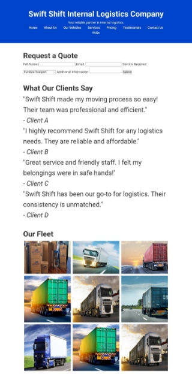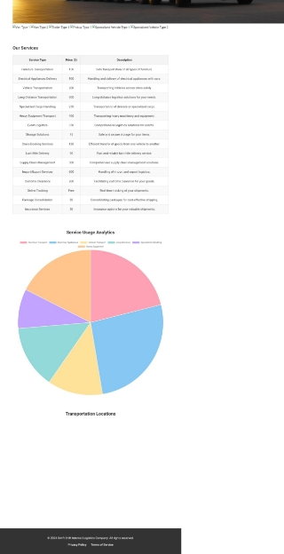![ref1]![ref1]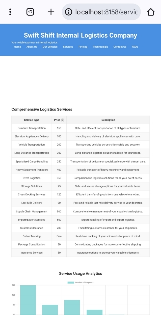

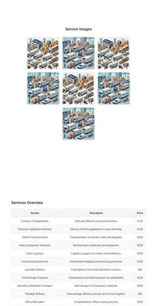

![ref2]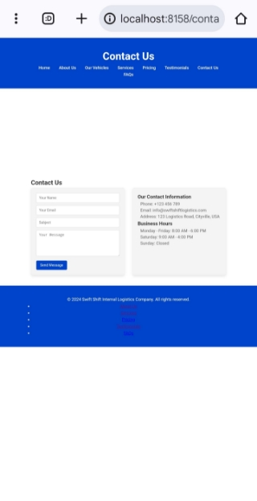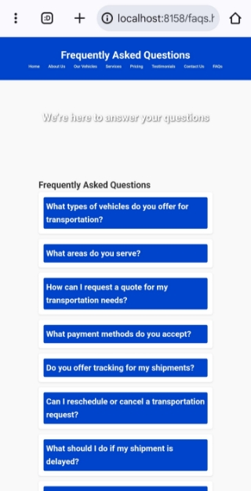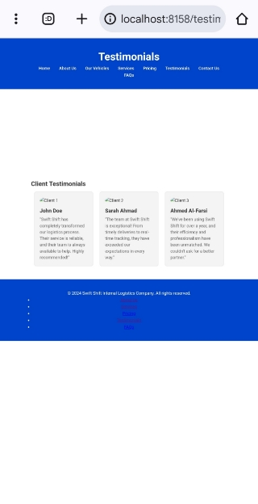![ref2]
###
### References
1. Council of Supply Chain Management Professionals. (2023). Supply Chain Management: A Logistics Perspective. Retrieved from [*Council of Supply Chain Management Professionals*](https://www.supplychain.org)
1. Chopra, S., & Meindl, P. (2019). Supply Chain Management: Strategy, Planning, and Operation (7th ed.). Pearson.
1. Coyle, J. J., Langley, C. J., Gibson, B. J., Novack, R. A., & Bardi, E. J. (2016). Supply Chain Management (10th ed.). Cengage Learning.
1. Mentzer, J. T., Min, S., & Zacharia, Z. G. (2000). The Nature of Interfirm Partnering in Supply Chain Management. Journal of Retailing, 76(4), 549-568. doi:10.1016/S0022-4359(00)00031-4
1. Harrison, A., & van Hoek, R. (2011). Logistics Management and Strategy: Competing Through the Supply Chain (3rd ed.). Pearson Education Limited.
1. Kotler, P., & Keller, K. L. (2016). Marketing Management (15th ed.). Pearson.
1. Bowersox, D. J., Closs, D. J., & Cooper, M. B. (2013). Supply Chain Logistics Management (5th ed.). McGraw-Hill Education.
1. International Transport Forum. (2021). Transport Outlook 2021: Trends in Global Transport. Retrieved from [*International Transport Forum*](https://www.itf-oecd.org)
1. Lund, R. T., & Kauffman, R. J. (2014). The Evolving Role of Technology in the Logistics Sector: A Review and Future Directions. Transportation Research Part E: Logistics and Transportation Review, 66, 1-13. doi:10.1016/j.tre.2014.02.003
1. Gonzalez, A. C., & Rainer, R. K. (2015). Market Research: Tools and Techniques. In A Practical Guide to Market Research (pp. 65-80). Springer.
1. Harvard Business Review. (2020). How to Build a Supply Chain that is Resilient. Retrieved from [*Harvard Business Review*](https://hbr.org)
1. Rao, P. H., & Holt, D. (2005). Do Green Supply Chains Lead to Competitiveness and Economic Performance? International Journal of Operations & Production Management, 25(9), 898-916. doi:10.1108/01409170510617167
1. United Nations Conference on Trade and Development. (2021). The Role of Logistics in Global Trade: A Study on the Impact of COVID-19. Retrieved from [*UNCTAD*](https://unctad.org)

63

[ref1]: Aspose.Words.a99470f5-acb6-4bf3-b926-bf11609d8d76.022.jpeg
[ref2]: Aspose.Words.a99470f5-acb6-4bf3-b926-bf11609d8d76.025.jpeg
